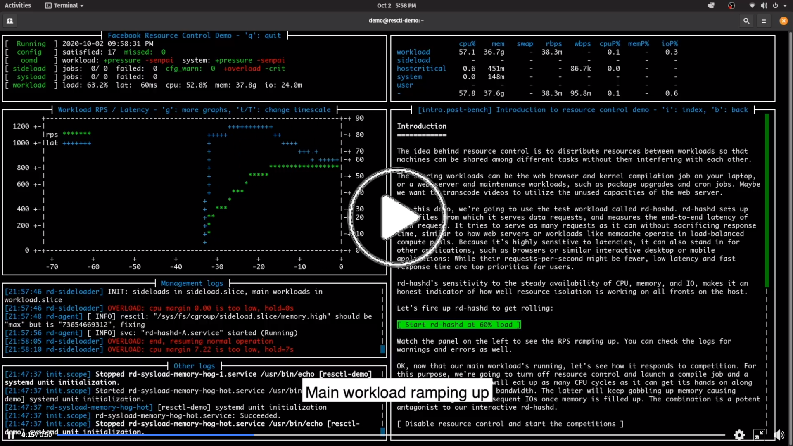

Resource control aims to control compute resource distribution to improve
reliability and utilization of a system. The facebook kernel and container teams
have been intensively researching and implementing mechanisms and methods to
advance resource control. resctl-demo demonstrates and documents various aspects
of resource control using self-contained workloads in guided scenarios.

<a href="https://www.facebook.com/Engineering/videos/695045534728386/">
  
</a>

## Getting Started

Comprehensive resource control has many requirements, some of which can be
difficult to configure on an existing system. resctl-demo provides premade
images to help getting started. Visit the following page for details:

  https://facebookmicrosites.github.io/resctl-demo-website

## Discussions

For discussions around resctl-demo and resource control in general:

  https://groups.google.com/g/resctl-demo

## Requirements

The basic building blocks are provided by the Linux kernel's cgroup2 and other
resource related features. On top, usage and configuration methods combined with
user-space helpers such as oomd and sideloader implement resource isolation to
achieve workload protection and stacking.

* Linux kernel >= v5.10

* cgroup2

* btrfs on non-composite storage device (sda or nvme0n1, not md or dm)

* Swap file on btrfs at least as large as 1/3 of physical memory

* systemd

* oomd

* python3, findmnt, dd, fio, stdbuf, gcc, ld, make, bison, flex, pkg-config,
  stress, libssl, libelf

## Building

```
$ cargo build --release
```

## Installing resctl-demo

```
$ sudo ./install.sh /usr/local/bin
```

## Running resctl-demo

```
$ sudo systemd-run --scope --slice hostcritical.slice --unit resctl-demo /usr/local/bin/resctl-demo
```

## License

resctl-demo is apache-2.0 licensed, as found in the [LICENSE](LICENSE) file.
